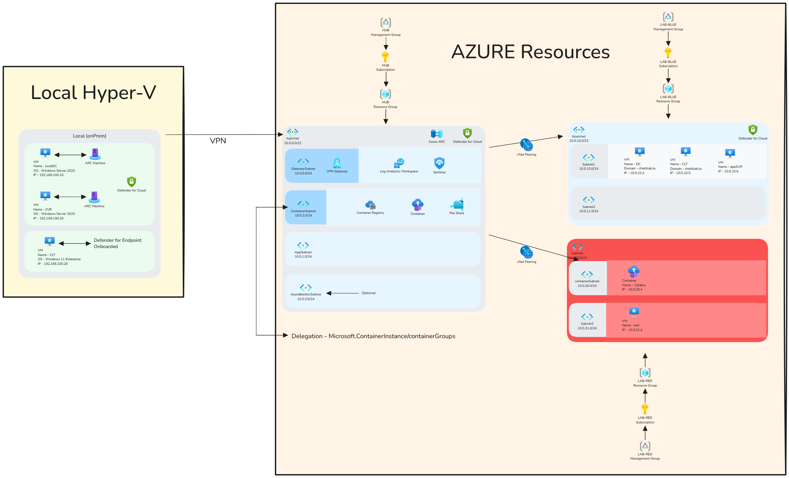

# 52. Azure Cyberlab Part 2 - Hub virtual network and VPN with PowerShell

- 🔧 Building Hub Infrastructure in Azure
The video begins with creating the foundational hub resource group using PowerShell. It involves defining IP space, choosing a region, and managing subscriptions.

- 🌐 Resource Group and VNET Setup
We make sure the correct subscription context is set before creating a resource group. Next, a virtual network (VNET) is deployed, and subnet delegations are defined to support services like container instances and Bastion host.

- 📊 Enabling Azure Sentinel
A Log Analytics workspace is created for Sentinel. We had a couple hiccups getting Sentinel enabled in the recording. Either deployment method has worked fine during my testing since recording.

- 🔐 VPN Gateway Configuration
The video configures a VPN gateway with Azure Active Directory (AAD) authentication. It walks through setting variables, creating a public IP, and extracting network info to deploy the gateway.

- 🔌 Client VPN Connection
After downloading and extracting a VPN config file, it’s imported into the VPN client to establish a successful connection.

### YouTube Video ###
https://youtu.be/EgM6fEJk_3A

### My Socials ###
BlueSky - https://bsky.app/profile/cyberautomate.bsky.social 
LinkedIn - https://linkedin.com/in/david-hall10  
Github - https://github.com/cyberautomate